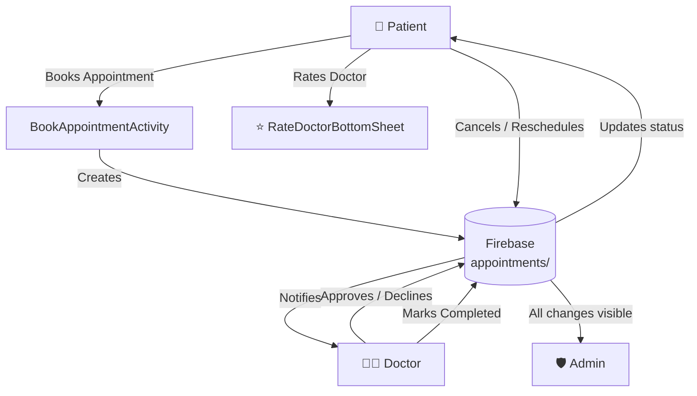
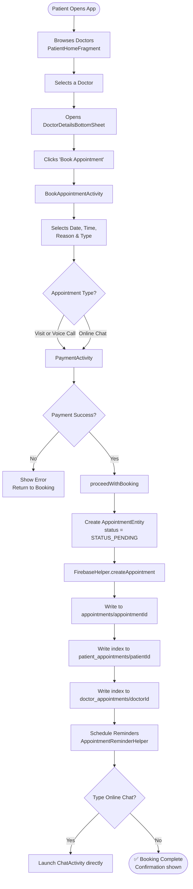
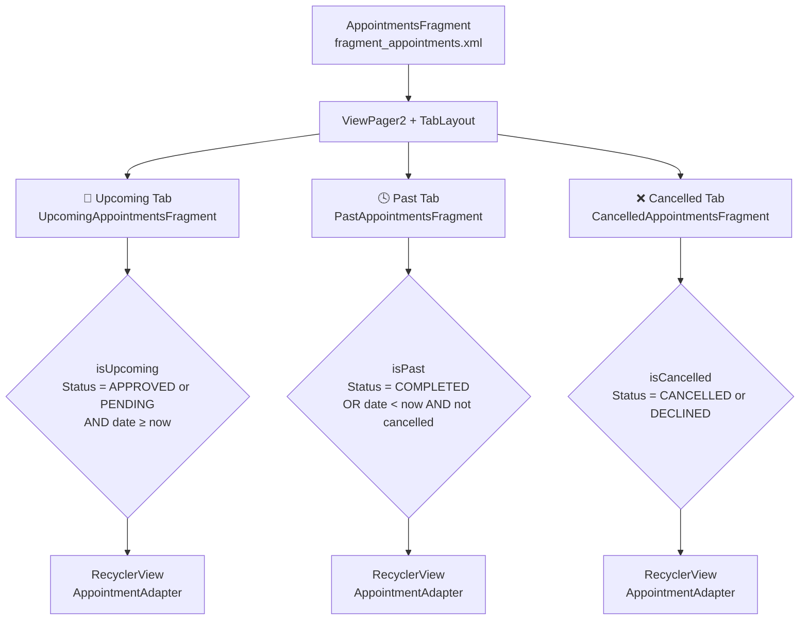
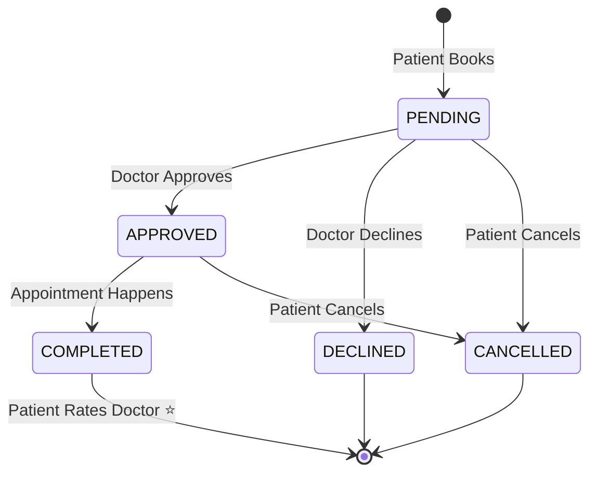
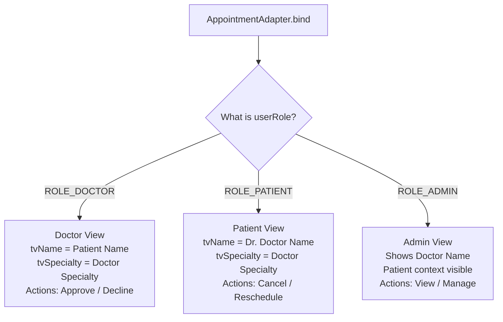
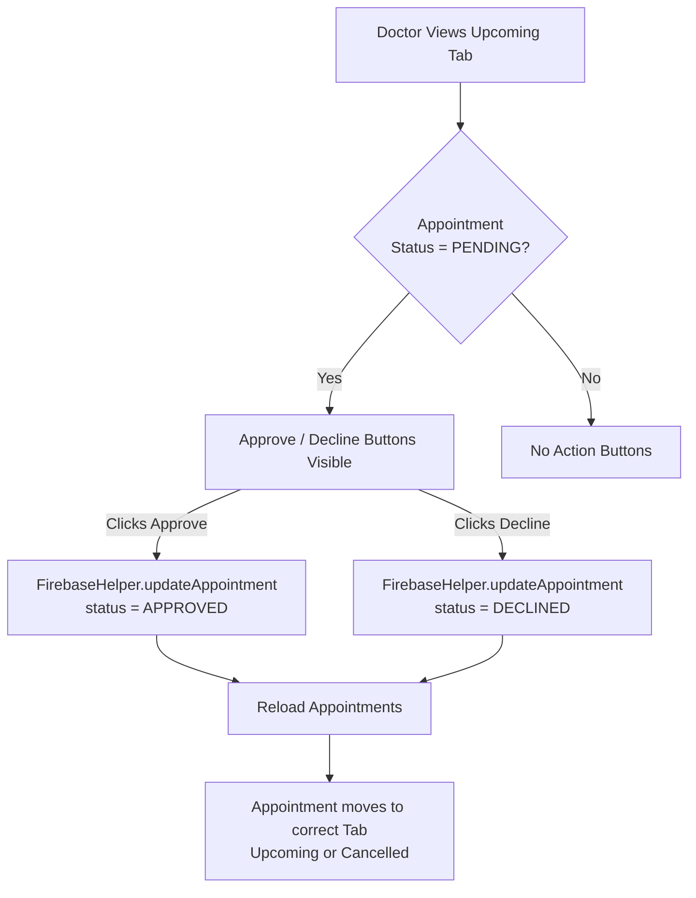
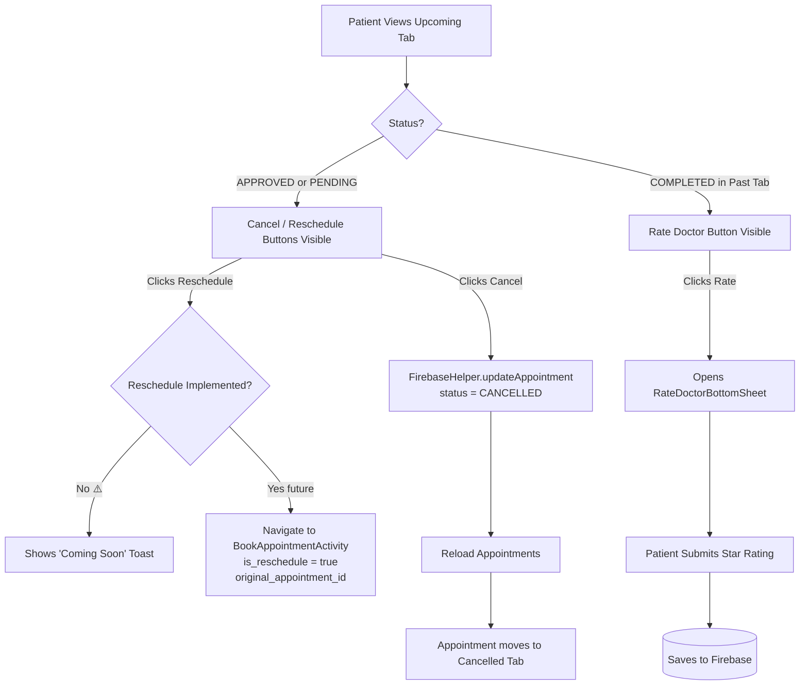
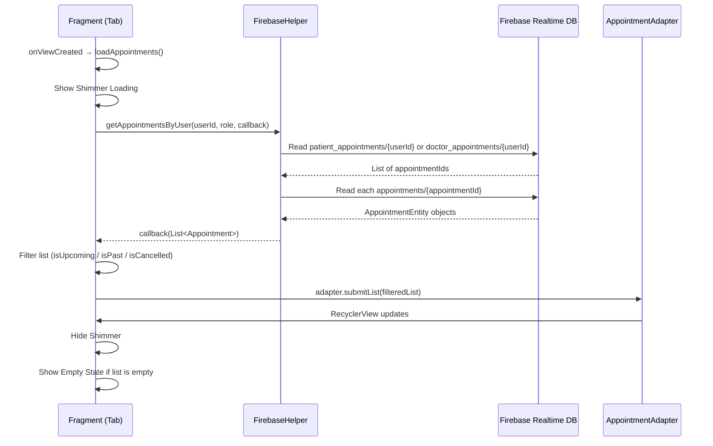

# 🏥 HASET App — Appointments System: Complete Guide
> *Combined from: APPOINTMENT_LOGIC_ANALYSIS.md · APPOINTMENT_DISPLAY_ANALYSIS.md · APPOINTMENTS_FRAGMENT_ANALYSIS.md*

---

## 📑 Table of Contents
1. [System Overview](#1-system-overview)
2. [Firebase Data Structure](#2-firebase-data-structure)
3. [Appointment Booking Flow](#3-appointment-booking-flow)
4. [Appointment Viewing & Tabs](#4-appointment-viewing--tabs)
5. [Status Lifecycle](#5-status-lifecycle)
6. [Role-Based Display Logic](#6-role-based-display-logic)
7. [Doctor Actions](#7-doctor-actions)
8. [Patient Actions](#8-patient-actions)
9. [Data Loading Flow](#9-data-loading-flow)
10. [Issues & Recommendations](#10-issues--recommendations)
11. [Testing Checklist](#11-testing-checklist)

---

## 1. System Overview

The HASET Appointments System provides a full lifecycle experience for scheduling consultations between **patients** and **doctors**, managed and monitored by **admins**.



---

## 2. Firebase Data Structure

```
Firebase Realtime Database
│
├── appointments/
│   └── {appointmentId}/
│       ├── appointmentId
│       ├── patientId
│       ├── patientName
│       ├── doctorId
│       ├── doctorName
│       ├── doctorSpecialty
│       ├── date
│       ├── time
│       ├── reason
│       ├── status           ← PENDING | APPROVED | DECLINED | COMPLETED | CANCELLED
│       ├── appointmentType  ← Visit | Online Chat | Voice Call
│       └── createdAt
│
├── patient_appointments/
│   └── {patientId}/
│       └── {appointmentId}: true  ← index reference
│
└── doctor_appointments/
    └── {doctorId}/
        └── {appointmentId}: true  ← index reference
```

---

## 3. Appointment Booking Flow



---

## 4. Appointment Viewing & Tabs

The **My Appointments** screen (`AppointmentsFragment`) uses a `ViewPager2` with 3 tabs.



### Tab Filter Summary

| Tab | Status Filter | Date Filter |
|-----|--------------|-------------|
| **Upcoming** | `APPROVED` or `PENDING` | date ≥ now |
| **Past** | `COMPLETED` or expired | date < now |
| **Cancelled** | `CANCELLED` or `DECLINED` | any |

---

## 5. Status Lifecycle



| Status | Who Sets It | Tab Shown In |
|--------|------------|--------------|
| `PENDING` | System (on booking) | Upcoming |
| `APPROVED` | Doctor | Upcoming |
| `DECLINED` | Doctor | Cancelled |
| `COMPLETED` | Doctor / System | Past |
| `CANCELLED` | Patient | Cancelled |

---

## 6. Role-Based Display Logic

The `AppointmentAdapter` uses the `userRole` to determine what each role sees in the appointment list.



### What Each Role Sees

#### 👨‍⚕️ Doctor View
| Field | Shows |
|-------|-------|
| Name | Patient's Name (e.g. "Sarah Johnson") |
| Specialty | Doctor's Specialty (e.g. "Cardiology") |
| Date/Time | Appointment schedule |
| Status | Current status badge |
| Actions | ✅ Approve · ❌ Decline (if PENDING) |

#### 👤 Patient View
| Field | Shows |
|-------|-------|
| Name | "Dr. {Doctor Name}" |
| Specialty | Doctor's Specialty |
| Date/Time | Appointment schedule |
| Status | Current status badge |
| Actions | ❌ Cancel · 🔄 Reschedule (upcoming) · ⭐ Rate (completed) |

#### 🛡️ Admin View
| Field | Shows |
|-------|-------|
| Name | Doctor Name |
| Patient | Patient Name visible for oversight |
| Specialty | Doctor's Specialty |
| Status | Current status badge |

---

## 7. Doctor Actions



---

## 8. Patient Actions



---

## 9. Data Loading Flow



---

## 10. Issues & Recommendations

### 🔴 Critical Issues

| # | Issue | Impact | Recommendation |
|---|-------|--------|----------------|
| 1 | **Approve/Decline shown in Past & Cancelled tabs** | UI confusion | Hide these buttons when `isPast()` or `isCancelled()` |
| 2 | **Reschedule not implemented** | Incomplete feature | Navigate to `BookAppointmentActivity` with reschedule flag |
| 3 | **No real-time updates** | Stale data | Switch from `addListenerForSingleValueEvent` to `addValueEventListener` |

### ⚠️ Medium Issues

| # | Issue | Impact | Recommendation |
|---|-------|--------|----------------|
| 4 | **Doctor specialty is null** in adapter | Display issues in list | Store specialty in `AppointmentEntity` at booking time |
| 5 | **Date/time parsing** can silently fail | Wrong tab placement | Standardize date format (ISO-8601) across the app |
| 6 | **Export CSV format bug** | Malformed export files | Fix quote concatenation in CSV export builder |
| 7 | **No appointment detail view** | Poor UX | Add a detail bottom sheet or activity on item click |
| 8 | **No `updatedAt` timestamp** | No audit trail | Add `updatedAt` field on every status change |
| 9 | **Refresh menu does nothing** | Confusing UX | Wire refresh menu item to call `loadAppointments()` |

### Reschedule Implementation (Future)

```java
@Override
public void onReschedule(Appointment appointment) {
    Intent intent = new Intent(requireContext(), BookAppointmentActivity.class);
    intent.putExtra(Constants.EXTRA_DOCTOR_ID, appointment.getDoctorId());
    intent.putExtra("is_reschedule", true);
    intent.putExtra("original_appointment_id", appointment.getAppointmentId());
    startActivity(intent);
}
```

---

## 11. Testing Checklist

### Booking
- [ ] Patient can select a doctor and open booking screen
- [ ] All appointment types are selectable (Visit, Online Chat)
- [ ] Payment flow completes before booking is saved
- [ ] Appointment saved to Firebase with `PENDING` status
- [ ] Reminder is scheduled after booking

### Tab Filtering
- [ ] Upcoming tab shows only `APPROVED` / `PENDING` with future dates
- [ ] Past tab shows only `COMPLETED` or expired appointments
- [ ] Cancelled tab shows only `CANCELLED` / `DECLINED`

### Role Display
- [ ] Doctor sees patient name in appointment list
- [ ] Patient sees "Dr. {Name}" in appointment list
- [ ] Specialty shown correctly for both roles

### Actions
- [ ] Doctor: Approve/Decline only visible on **PENDING** appointments in Upcoming tab
- [ ] Patient: Cancel/Reschedule only visible on **upcoming** appointments
- [ ] Patient: Rate Doctor only visible on **COMPLETED** appointments in Past tab
- [ ] Approve/Decline **not** visible in Past or Cancelled tabs

### UI
- [ ] Shimmer loading shows during data fetch
- [ ] Empty state shows when no appointments exist for a tab
- [ ] Error state handles Firebase failures gracefully
- [ ] Export CSV generates a valid file

---

*Last Updated: 2026-02-22 | HASET App — Appointments Module*
