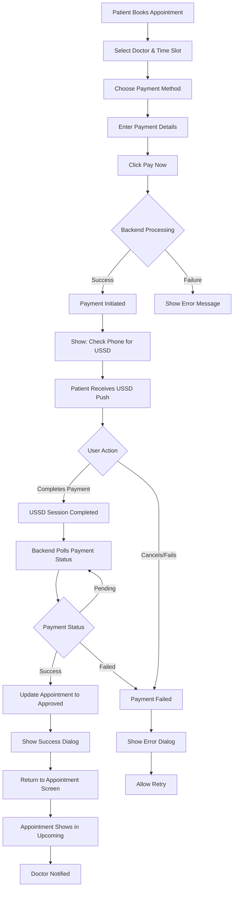

# HASET Health - Complete Documentation

> **Version:** 2.0.0  
> **Last Updated:** February 2026  
> **Status:** Production-Ready Testing

---

## 📊 Project Overview

HASET Health is a comprehensive healthcare platform connecting patients, doctors, and pharmacies through an Android application and Laravel payment backend.

### Project Statistics

| Component | Files | Lines of Code | Technology |
|-----------|-------|---------------|------------|
| **Android App (Logic)** | 218 | 42,802 | Java (Native) |
| **Android UI (Resources)** | 414 | 26,374 | XML / MD3 |
| **Payment Backend** | 10 | 784 | PHP / Laravel |
| **Total** | **642** | **~70,000+** | |

---

## 🌟 Key Features

### 🏥 For Patients
- Smart Onboarding with role-based registration
- Doctor Discovery (search by specialty, rating, experience)
- Instant Booking with USSD payment confirmation
- Health Wallet & Transaction History
- Pharmacy - Browse medicines, manage cart, order prescriptions
- Smart Notifications & Reminders

### 👨‍⚕️ For Doctors
- Professional Dashboard (pending, approved, completed appointments)
- Earnings Wallet with withdrawal capabilities
- Prescription Management
- Availability Control
- Profile Management

### 💬 Communication
- Real-time Chat with file/image/audio support
- Payment Gateway (Zeno - M-Pesa, Tigo Pesa, Airtel Money)
- Secure File Sharing

---

## 🛠️ Technology Stack

### Mobile (Android)
- **Architecture:** MVVM + Repository Pattern
- **Local Storage:** Room Database/SQLite
- **Networking:** Retrofit 2 & GSON
- **Image Processing:** Glide with Shimmer loading
- **Animations:** Facebook Shimmer & Material Motion
- **Authentication:** Firebase Auth

### Backend (Laravel)
- **Framework:** Laravel 12.x
- **Database:** SQLite (Dev) / MySQL (Prod)
- **Payment Engine:** Zeno USSD Push Service
- **Real-time:** Firebase Realtime Database

---

## 📋 TODO List - Priority Tasks

### 1. Notifications
- [ ] Implement in-app phone notification popup for received messages
- [ ] Analyze all notification configs for all roles
- [ ] Make notification preferences in profile functional

### 2. Language & UI
- [ ] Complete language switcher implementation
- [ ] Complete language translation for entire app
- [ ] Make app stable when changing language
- [ ] Fix shimmer phase issues

### 3. Chat & Messages
- [ ] Fix message arrangement in chat room (proper sorting)
- [ ] Make Delete message option functional
- [ ] Implement delete functionality for messages

### 4. Payment & Money
- [ ] Implement doctor withdrawal of earned money
- [ ] Configure deduction system (amount deducted first, then actual amount sent)
- [ ] Analyze promotion banner functionality

### 5. Doctor Features
- [ ] Implement doctor verification check against mct.go.tz API

### 6. User Account
- [ ] Fix Delete account functionality
- [ ] Configure forgot password functionality
- [ ] Review OTP requirement for registration

### 7. Admin Features
- [ ] Fix user bottom sheet not opening in admin part

### 8. Code Analysis
- [ ] Count total lines of code
- [ ] Complete translation of entire app

---

## 💳 Payment Flow

### Flow Diagram



### API Endpoints

```http
# Initiate Payment
POST /api/payment/initiate
{
    "user_id": "user_123",
    "doctor_id": "doctor_456",
    "amount": 500,
    "provider": "Mixx By Yas",
    "payment_account": "+255712345678"
}

# Check Status
GET /api/payment/status?transaction_id=54

# Webhook Callback
POST /api/payment/callback
```

### Payment Amount Limits

```java
MIN_PAYMENT_AMOUNT = 100 TZS
MAX_PAYMENT_AMOUNT = 10,000,000 TZS
```

### Payment Providers

| Provider | Type |
|----------|------|
| Mixx By Yas | Mobile Money |
| Mpesa | Mobile Money |
| CRDB | Mobile Banking |
| NMB | Mobile Banking |

---

## 🔔 Notification System

### Notification Managers by Role

| Role | File | Channels |
|------|------|----------|
| **Patient** | `PatientNotificationManager.java` | Appointments, Health Tips |
| **Doctor** | `DoctorNotificationManager.java` | Appointments, Patient Messages |
| **Admin** | `AdminNotificationManager.java` | Admin Tips |
| **All** | `MessageNotificationManager.java` | Chat Messages |
| **All** | `CallNotificationManager.java` | Incoming Calls |

### Channel IDs

```java
// Patient
CHANNEL_APPOINTMENTS = "haset_appointments"
CHANNEL_HEALTH_TIPS = "haset_health_tips"

// Doctor  
CHANNEL_APPOINTMENTS = "doctor_appointments"
CHANNEL_PATIENT_MESSAGES = "doctor_messages"

// Admin
CHANNEL_ADMIN_TIPS = "admin_tips"

// General
CHANNEL_ID_MESSAGES = "haset_messages"
```

---

## 🔗 Important URLs

| Service | URL |
|---------|-----|
| Main Website | https://hasethospital.or.tz/ |
| Terms & Conditions | https://hasethospital.or.tz/legal/terms |
| Privacy Policy | https://hasethospital.or.tz/legal/privacy-policy |
| Doctor Verification API | https://mct.go.tz/oas/register/searchDoctors.php |

---

## 🔧 Firebase Configuration

- **Project ID:** hasetapp-4eeba
- **Sender Email:** noreply@hasetapp-4eeba.firebaseapp.com
- **Sender Name:** HASETAdmin

### Email Verification Template

```
Subject: Verify your email for HASET

Hello %DISPLAY_NAME%,

Follow this link to verify your email address.

https://hasetapp-4eeba.firebaseapp.com/__/auth/action?mode=action&oobCode=code

If you didn't ask to verify this address, you can ignore this email.

Thanks,
Your %APP_NAME% team
```

---

## 🚀 Getting Started

### Backend Commands

```bash
# Start Laravel backend
cd haset-backend/HASET-Backend
php artisan serve --host=0.0.0.0 --port=8000

# Start ngrok tunnel
ngrok http 8000

# Combined
cd haset-backend && php artisan serve --host=0.0.0.0 --port=8000 && ngrok http 8000
```

### Android Setup

1. Open in Android Studio Jellyfish+
2. Ensure `google-services.json` is in `app/` directory
3. Sync Gradle and build
4. Update `Constants.java` with backend URL

---

## 📁 Key Files

### Android

| File | Purpose |
|------|---------|
| `Constants.java` | API URLs, configuration |
| `PaymentActivity.java` | Payment screen UI |
| `PaymentRepository.java` | API communication |
| `FirebaseHelper.java` | Firebase operations |
| `RetrofitClient.java` | Network client |

### Backend

| File | Purpose |
|------|---------|
| `PaymentController.php` | Payment API endpoints |
| `ZenoService.php` | Payment gateway integration |
| `routes/api.php` | API routes |
| `.env` | Configuration |

---

## 🔐 Security Features

- Firebase Authentication
- Network Security Config (blocks HTTP, enforces HTTPS)
- `allowBackup=false`
- `usesCleartextTraffic=false`
- ProGuard enabled for release builds

---

## 📝 Version History

| Version | Date | Description |
|---------|------|-------------|
| 2.0.0 | Feb 2026 | Complete rewrite with payment integration |
| 1.0.0 | 2024 | Initial release |

---

*Last Updated: 2026-02-22 - by MrDino from DTC*
