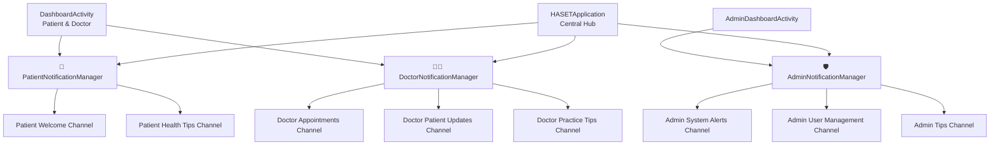
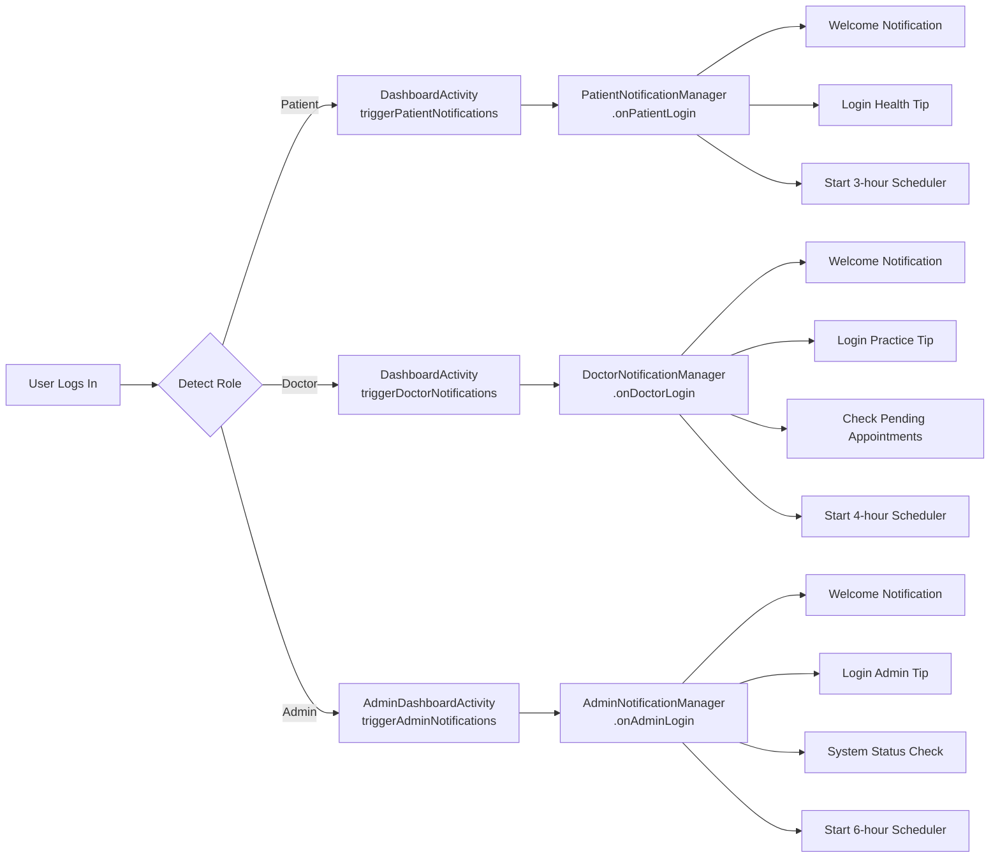
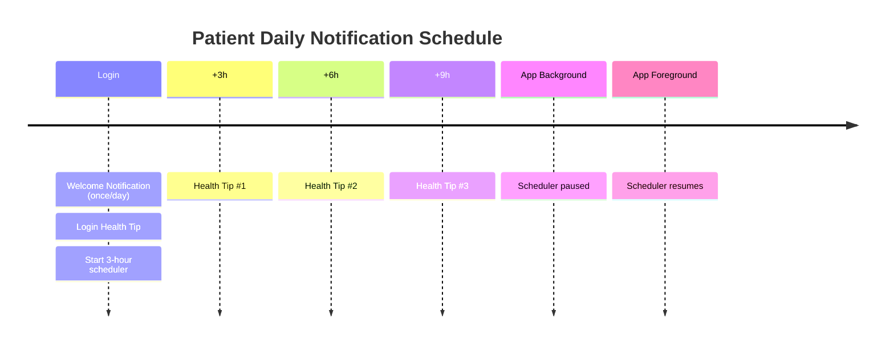
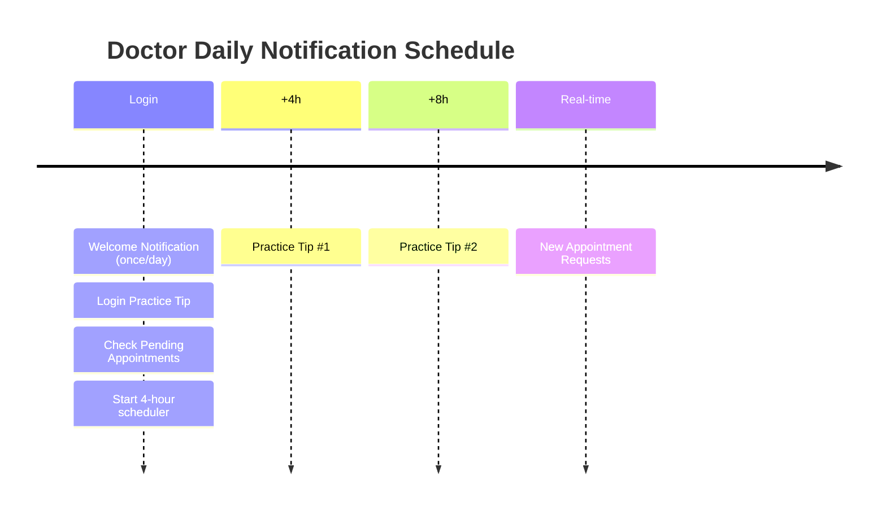
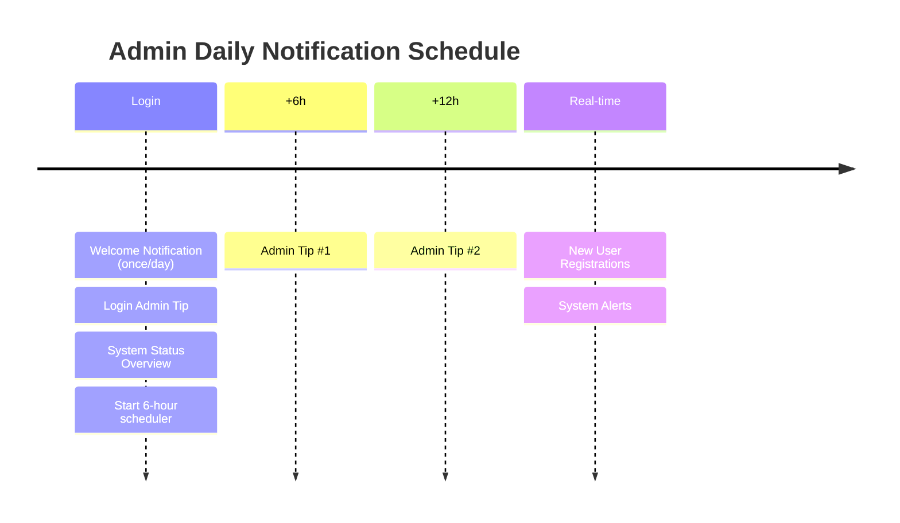
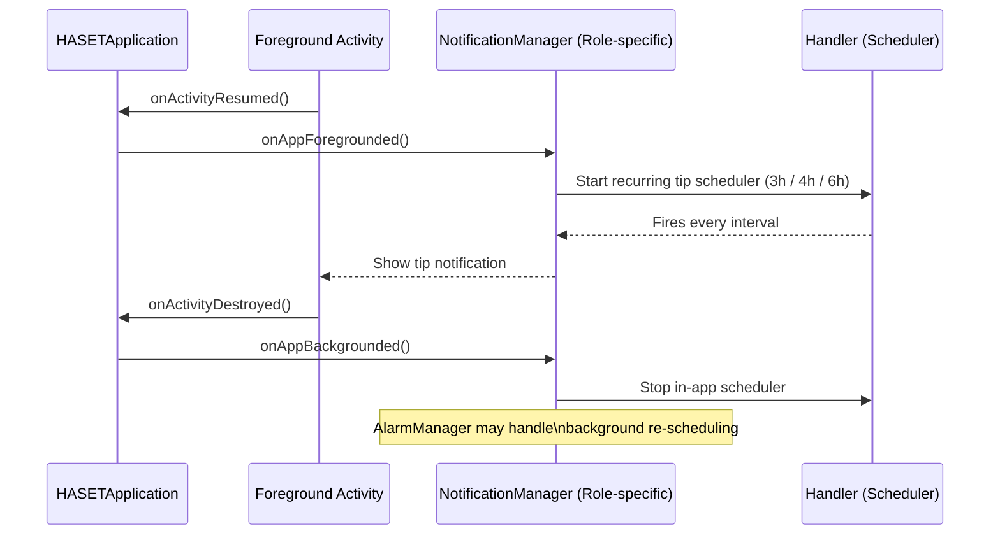
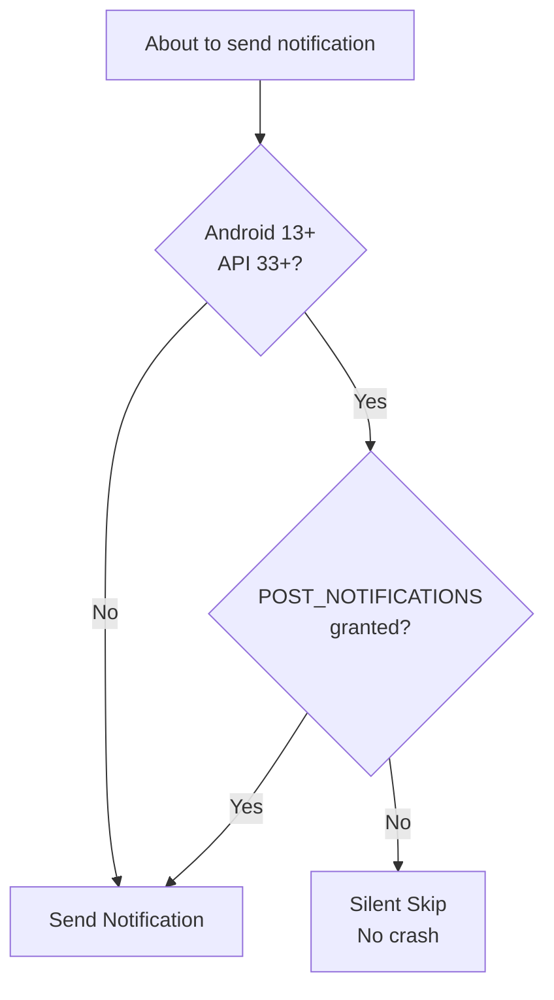

# 🔔 HASET App — Notifications System: Complete Guide
> *Combined from: PATIENT_NOTIFICATIONS_GUIDE.md · ROLE_NOTIFICATIONS_GUIDE.md*

---

## 📑 Table of Contents
1. [System Overview](#1-system-overview)
2. [Architecture](#2-architecture)
3. [Notification Channels](#3-notification-channels)
4. [Patient Notifications](#4-patient-notifications)
5. [Doctor Notifications](#5-doctor-notifications)
6. [Admin Notifications](#6-admin-notifications)
7. [App Lifecycle Management](#7-app-lifecycle-management)
8. [Permissions & Rate Limiting](#8-permissions--rate-limiting)
9. [Configuration & Customization](#9-configuration--customization)
10. [User Experience Examples](#10-user-experience-examples)
11. [Technical Reference](#11-technical-reference)

---

## 1. System Overview

The HASET notification system is **fully role-separated** — each role (Patient, Doctor, Admin) has its own dedicated notification manager, channels, schedules, and content. No cross-role notifications are ever shown.



---

## 2. Architecture



---

## 3. Notification Channels

| Role | Channel ID | Purpose | Priority |
|------|-----------|---------|----------|
| 👤 Patient | `patient_welcome_channel` | Welcome notifications | Default |
| 👤 Patient | `patient_health_tips_channel` | Health tips (login + recurring) | Default |
| 👨‍⚕️ Doctor | `doctor_appointments_channel` | Welcome + pending appointment alerts | **High** |
| 👨‍⚕️ Doctor | `doctor_patient_updates_channel` | Real-time new appointment requests | **High** |
| 👨‍⚕️ Doctor | `doctor_practice_tips_channel` | Practice tips (login + recurring) | Default |
| 🛡️ Admin | `admin_system_alerts_channel` | Welcome + system status + critical alerts | **High** |
| 🛡️ Admin | `admin_user_management_channel` | New user registrations | Default |
| 🛡️ Admin | `admin_admin_tips_channel` | Admin tips (login + recurring) | Default |

---

## 4. Patient Notifications

### Schedule


### Notification Types

| ID | Type | Trigger | Channel |
|----|------|---------|---------|
| 3001 | Welcome | Login (once/day) | patient_welcome_channel |
| 3002 | Login Health Tip | Every login | patient_health_tips_channel |
| 3100+ | Recurring Health Tips | Every 3 hours (app active) | patient_health_tips_channel |

### Content Examples

**Welcome (Time-based greeting):**
- 🌅 Morning: *"Good morning, [Name]! Welcome back to HASET."*
- 🌞 Afternoon: *"Good afternoon, [Name]! Welcome back to HASET."*
- 🌙 Evening: *"Good evening, [Name]! Welcome back to HASET."*

**Health Tips:**
- *"💧 Time to hydrate! Drink a glass of water now."*
- *"🚶‍♀️ Stand up and stretch for 2 minutes."*
- *"👀 Look away from your screen for 20 seconds."*
- *"🧘 Take 3 deep breaths to relax your mind."*
- *"🍎 Grab a healthy snack if you're feeling hungry."*
- *"😊 Smile! It can improve your mood instantly."*

---

## 5. Doctor Notifications

### Schedule


### Notification Types

| ID | Type | Trigger | Channel |
|----|------|---------|---------|
| 4001 | Welcome | Login (once/day) | doctor_appointments_channel |
| 4002 | Login Practice Tip | Every login | doctor_practice_tips_channel |
| 4003 | Pending Appointments | Login (if pending exist) | doctor_appointments_channel |
| 4004 | New Appointment Request | Real-time (when patient books) | doctor_patient_updates_channel |
| 4100+ | Recurring Practice Tips | Every 4 hours (app active) | doctor_practice_tips_channel |

### Content Examples

**Welcome:**
- *"Good morning, Dr. Johnson! Ready for your practice today?"*

**Practice Tips:**
- *"🩺 Take a 5-minute break between patients to reset and refocus."*
- *"📋 Update patient notes immediately after consultation while details are fresh."*
- *"💧 Stay hydrated - keep a water bottle accessible during consultations."*
- *"👀 Practice active listening - maintain eye contact with patients."*

**Pending Appointments:**
- *"You have 3 pending appointments to review."* — High priority

**New Appointment Request:**
- *"New appointment request from Sarah Johnson [Date & Time]"* — With Approve/Decline quick action

---

## 6. Admin Notifications

### Schedule


### Notification Types

| ID | Type | Trigger | Channel |
|----|------|---------|---------|
| 5001 | Welcome | Login (once/day) | admin_system_alerts_channel |
| 5002 | Login Admin Tip | Every login | admin_admin_tips_channel |
| 5003 | System Status | Login (system check) | admin_system_alerts_channel |
| 5004 | New User Registration | Real-time | admin_user_management_channel |
| 5005 | System Alert | Critical system event | admin_system_alerts_channel |
| 5100+ | Recurring Admin Tips | Every 6 hours (app active) | admin_admin_tips_channel |

### Content Examples

**Welcome:**
- *"Good morning, Admin! System is ready for oversight."*

**System Status:**
- *"System Status: 245 total users (45 doctors, 200 patients)"*

**Admin Tips:**
- *"🔐 Review security settings and ensure proper access controls are in place."*
- *"📊 Check system performance metrics and address any bottlenecks."*
- *"💾 Verify that automated backups are completing successfully."*
- *"👥 Monitor user registration patterns for any unusual activity."*

**New User Registration:**
- *"New doctor registration: Dr. Michael Chen — john@example.com"*

---

## 7. App Lifecycle Management



### Key Methods

```java
// HASETApplication.java
patientNotificationManager.onAppForegrounded();
doctorNotificationManager.onAppForegrounded();
adminNotificationManager.onAppForegrounded();

// Each Manager
onPatientLogin(String userName)   // Patient-specific
onDoctorLogin(String userName)    // Doctor-specific
onAdminLogin(String userName)     // Admin-specific

onAppForegrounded()    // Start recurring scheduler
onAppBackgrounded()    // Stop recurring scheduler
```

---

## 8. Permissions & Rate Limiting

### Permission Handling


### Rate Limits by Role

| Role | Welcome | Tips Interval |
|------|---------|--------------|
| 👤 Patient | Once per day | Every **3 hours** |
| 👨‍⚕️ Doctor | Once per day | Every **4 hours** |
| 🛡️ Admin | Once per day | Every **6 hours** |

**Storage Keys (SharedPreferences):**
```
patient_notifications → last_login_date, last_health_tip_time, app_active_tips_enabled
doctor_notifications  → last_login_date, last_practice_tip_time, practice_tips_enabled
admin_notifications   → last_login_date, last_admin_tip_time, admin_tips_enabled
```

---

## 9. Configuration & Customization

### Interval Settings
```java
// PatientNotificationManager.java
private static final long HEALTH_TIP_INTERVAL_MS = TimeUnit.HOURS.toMillis(3);

// DoctorNotificationManager.java
private static final long PRACTICE_TIP_INTERVAL_MS = TimeUnit.HOURS.toMillis(4);

// AdminNotificationManager.java
private static final long ADMIN_TIP_INTERVAL_MS = TimeUnit.HOURS.toMillis(6);
```

### Notification ID Ranges

| Range | Owner |
|-------|-------|
| 3001–3199 | Patient notifications |
| 4001–4199 | Doctor notifications |
| 5001–5199 | Admin notifications |

---

## 10. User Experience Examples

### 🌅 Morning Login Comparison (8:00 AM)

#### 👤 Patient
> 🔔 *"Good morning, Sarah! Welcome back to HASET."*  
> 💡 *"🌅 Start your day with a glass of water and 5 minutes of stretching."*  
> ⏰ Next health tip at 11:00 AM

#### 👨‍⚕️ Doctor
> 🔔 *"Good morning, Dr. Johnson! Ready for your practice today?"*  
> 💡 *"🩺 Review your patient appointments for today and prepare for consultations."*  
> 📋 *"You have 3 pending appointments to review."*  
> ⏰ Next practice tip at 12:00 PM

#### 🛡️ Admin
> 🔔 *"Good morning, Admin! System is ready for oversight."*  
> 💡 *"🛡️ Review system logs and ensure all services are running smoothly."*  
> 📊 *"System Status: 245 total users (45 doctors, 200 patients)"*  
> ⏰ Next admin tip at 2:00 PM

---

## 11. Technical Reference

### Files Created/Modified

| File | Purpose |
|------|---------|
| `PatientNotificationManager.java` | Patient notifications (300+ lines) |
| `DoctorNotificationManager.java` | Doctor notifications (450+ lines) |
| `AdminNotificationManager.java` | Admin notifications (500+ lines) |
| `HASETApplication.java` | App lifecycle, manager initialization |
| `DashboardActivity.java` | Trigger patient/doctor notifications on login |
| `AdminDashboardActivity.java` | Trigger admin notifications on login |

### Handler-Based Scheduling
```java
// Uses Handler with Looper.getMainLooper()
// Memory-efficient, automatic cleanup on background
// No WorkManager / AlarmManager overhead for app-active tips

handler.postDelayed(new Runnable() {
    @Override
    public void run() {
        showRecurringTip();
        handler.postDelayed(this, INTERVAL_MS);  // reschedule
    }
}, INTERVAL_MS);

// Stop in onAppBackgrounded():
handler.removeCallbacksAndMessages(null);
```

---

## 12. Badge Behavior (Non-Intrusive Design)

### Overview
The notification badge system is designed to be **non-intrusive** - it only shows NEW notifications since the user's last app session, and automatically clears when the app opens.

### How It Works

| Scenario | Badge Behavior |
|----------|---------------|
| User opens app | Badge clears automatically |
| New notification arrives after app opened | Badge shows count |
| User opens notification activity | Badge clears |
| User returns to app later | Badge shows only NEW notifications since last open |

### Implementation Details

**Option 1 - Only NEW notifications:**
- `NotificationBadgeHelper` tracks `last_app_open_timestamp`
- `new_notifications_since_last_open` counter increments when new notifications arrive
- Badge shows count of notifications received since last app session

**Option 2 - Auto-clear on app open:**
- `onAppOpened()` called in `DashboardActivity.onCreate()`
- Clears the `new_notifications_since_last_open` counter
- User sees fresh start each time they open the app

### Key Methods

```java
// Called when app opens - clears badge for fresh start
badgeHelper.onAppOpened();

// Called when new notification arrives
badgeHelper.incrementNewNotifications();

// Get only NEW notifications since last open
int newCount = badgeHelper.getNewNotificationsSinceLastOpen();

// Check if badge should show
boolean shouldShow = badgeHelper.shouldShowBadge();
```

### Files Affected

| File | Purpose |
|------|---------|
| `NotificationBadgeHelper.java` | Added session tracking methods |
| `DashboardActivity.java` | Calls `onAppOpened()` on app start |
| `HomeViewModel.java` | Updated to use new notifications count |
| `DoctorHomeViewModel.java` | Updated to use new notifications count |

### User Experience

**Before (Annoying):**
- Badge always shows total unread count
- User sees old notifications every time they open
- Feels like "you have 47 unread messages" even if they're weeks old

**After (Non-Intrusive):**
- Badge shows only notifications from current session
- Clears automatically when app opens
- "Fresh" feeling - only new stuff shows up

---

*Last Updated: 2026-04-05 | HASET App — Notifications Module*
