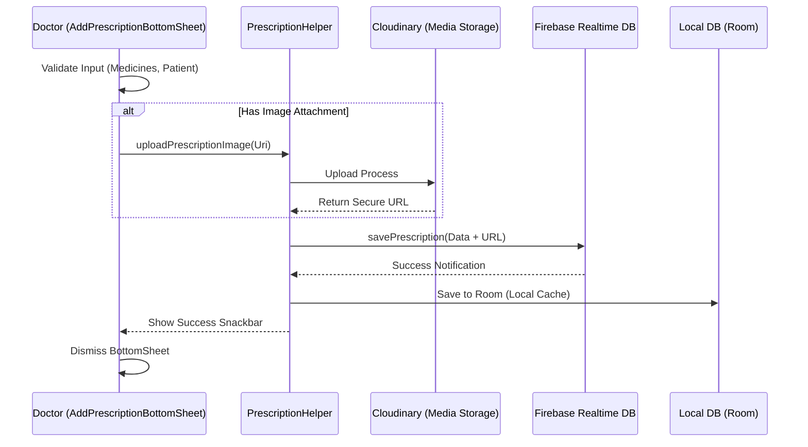
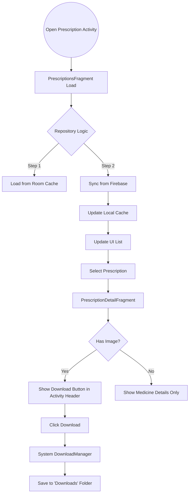

# Prescription Module Logic Flow

This document outlines the end-to-end logic for issuing, synchronizing, and viewing prescriptions within the HASET App.

## 1. Issuing a Prescription (Doctor Flow)

When a doctor issues a prescription, the app handles multi-stage synchronization involving Cloudinary (for images) and Firebase (for data).

---

## 2. Viewing and Downloading (Patient/Doctor Flow)

The app uses a Repository pattern and LiveData to ensure data is always available, even offline.

---

## 3. Key Components Logic

### A. Dynamic Header Management
The `PrescriptionActivity` acts as a controller for the global header. 
- **PrescriptionsFragment**: Tells Activity to set title to "My Prescriptions" and hide download button.
- **PrescriptionDetailFragment**: Tells Activity to set title to "Details" and show the download button if `imageUrl` is present.

### B. Repository Pattern
`PrescriptionRepository` implements a **Single Source of Truth** logic:
1. It immediately returns `LiveData` from the local Room database (instant load).
2. It attaches a `ValueEventListener` to Firebase.
3. When Firebase data changes, it updates the Local DB.
4. The UI automatically refreshes because it is observing the Local DB via LiveData.

### C. Medicine Adapter Logic
Medicines are stored as a JSON string in the Local DB (using Type Converters) and as a List in the UI. The `MedicineAdapter` displays:
- **Name**: Primary focus.
- **Dosage & Frequency**: Informational.
- **Duration**: Dynamically formatted string (e.g., "7 days").
