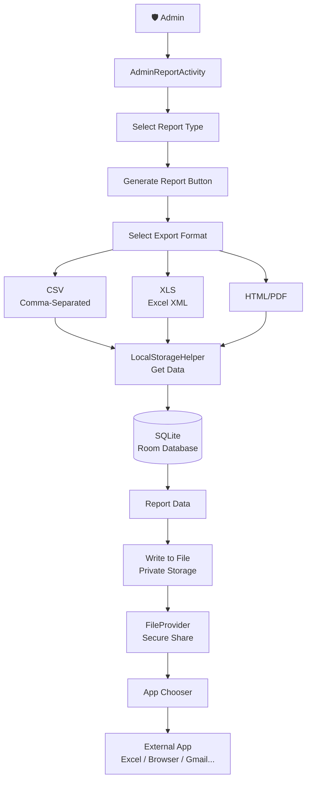
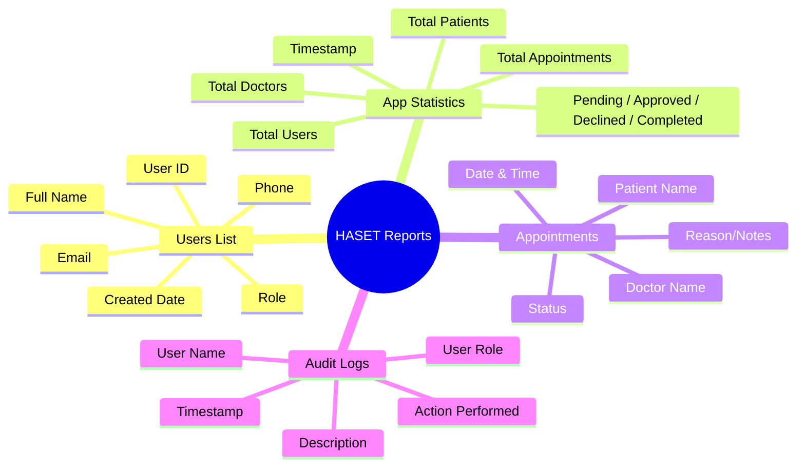
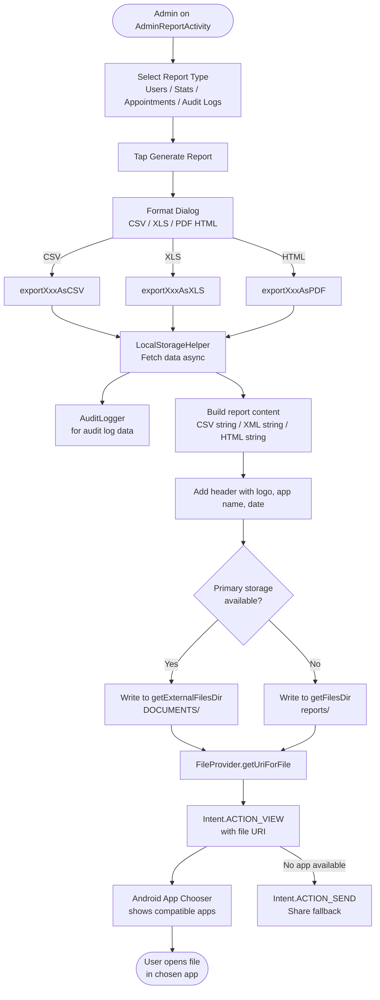
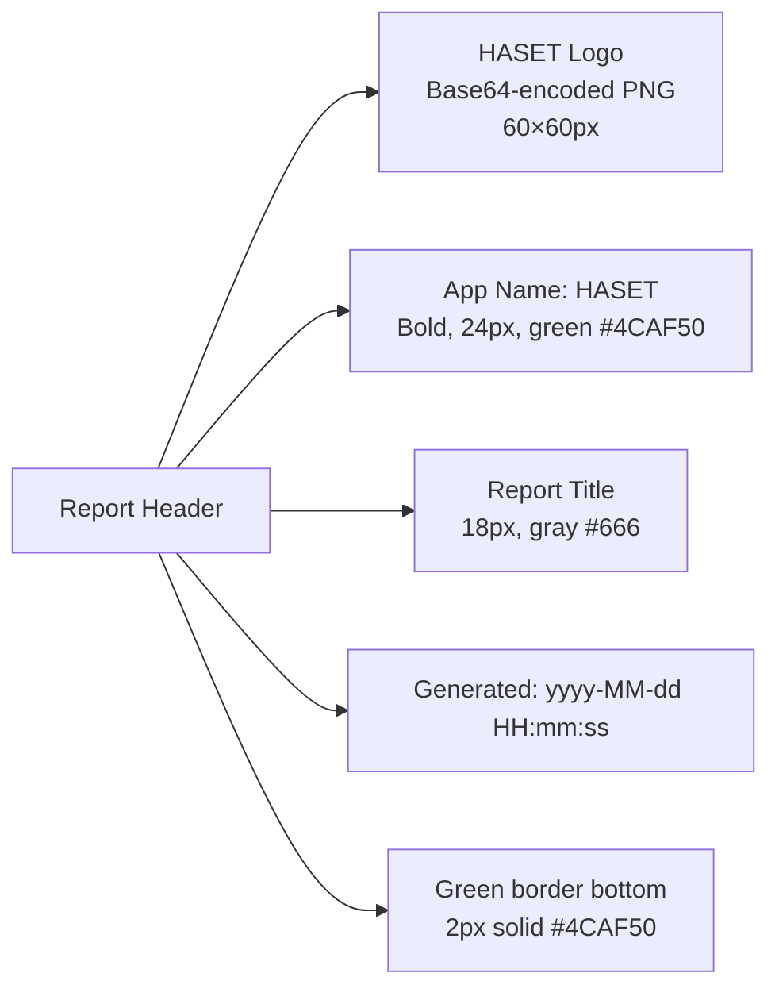
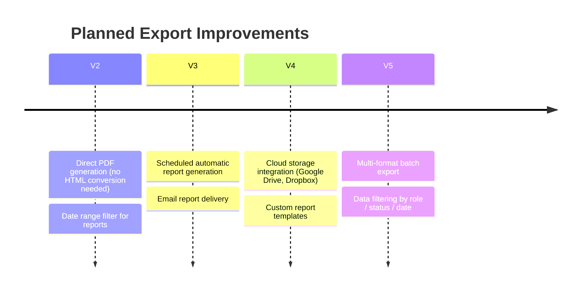

# 📊 HASET App — Export Reports System: Complete Guide
> *Combined from: EXPORT_REPORTS_DOCUMENTATION.md*

---

## 📑 Table of Contents
1. [System Overview](#1-system-overview)
2. [Report Types](#2-report-types)
3. [Export Formats](#3-export-formats)
4. [Export Flow](#4-export-flow)
5. [File Storage & Naming](#5-file-storage--naming)
6. [Report Branding & Header](#6-report-branding--header)
7. [Technical Implementation](#7-technical-implementation)
8. [Format Structures](#8-format-structures)
9. [Error Handling](#9-error-handling)
10. [Troubleshooting](#10-troubleshooting)
11. [Future Enhancements](#11-future-enhancements)

---

## 1. System Overview

The HASET export system allows **Admins** to generate professionally branded reports from live app data and export them in multiple formats for offline viewing, analysis, or sharing.



---

## 2. Report Types



### Report Details

#### 1. Users List Report
| Column | Source |
|--------|--------|
| User ID | `users.userId` |
| Full Name | `users.fullName` |
| Email | `users.email` |
| Phone | `users.phone` |
| Role | `users.role` |
| Created Date | `users.createdAt` |

#### 2. App Statistics Report
| Metric | Source |
|--------|--------|
| Total Users | COUNT all users |
| Total Doctors | COUNT users WHERE role = doctor |
| Total Patients | COUNT users WHERE role = patient |
| Total Appointments | COUNT all appointments |
| Pending / Approved / Declined / Completed | COUNT by status |
| Generated At | `System.currentTimeMillis()` |

#### 3. Appointments Report
| Column | Source |
|--------|--------|
| Patient Name | `appointments.patientName` |
| Doctor Name | `appointments.doctorName` |
| Date | `appointments.date` |
| Time | `appointments.time` |
| Status | `appointments.status` |
| Reason | `appointments.reason` |

#### 4. Audit Logs Report
| Column | Source |
|--------|--------|
| User Name | `users.fullName` (joined) |
| User Role | `users.role` |
| Action | `audit_logs.action` |
| Description | `audit_logs.details` |
| Timestamp | `audit_logs.timestamp` |

---

## 3. Export Formats

| Format | MIME Type | Extension | Best For | Compatible Apps |
|--------|-----------|-----------|----------|----------------|
| **CSV** | `text/csv` | `.csv` | Data analysis, spreadsheet import | Excel, Google Sheets, WPS, LibreOffice |
| **XLS** | `application/vnd.ms-excel` | `.xls` | Excel-native formatting | Excel, Google Sheets, WPS, LibreOffice |
| **HTML/PDF** | `text/html` | `.html` | Viewing, printing, PDF conversion | Chrome, Firefox, Edge, any browser |

---

## 4. Export Flow



---

## 5. File Storage & Naming

### Storage Location
- **Primary:** `getExternalFilesDir(Environment.DIRECTORY_DOCUMENTS)/`
- **Fallback:** `getFilesDir()/reports/`
- **Authority:** `com.haset.hasetapp.provider`

### File Naming Convention

| Report | File Name |
|--------|-----------|
| Users List | `users_report.[csv|xls|html]` |
| App Statistics | `statistics_report.[csv|xls|html]` |
| Appointments | `appointments_report.[csv|xls|html]` |
| Audit Logs | `audit_logs_report.[csv|xls|html]` |

### FileProvider Paths (`file_paths.xml`)
```xml
<paths xmlns:android="http://schemas.android.com/apk/res/android">
    <external-files-path name="images" path="Pictures/" />
    <files-path name="profile_photos" path="profile_photos/" />
    <files-path name="reports" path="reports/" />
    <cache-path name="cache" path="." />
</paths>
```

---

## 6. Report Branding & Header

All exported reports include a professional HASET-branded header.



### HTML Header Structure
```html
<div class='header'>
  
  <div class='header-text'>
    <h1 class='app-name' style='color:#4CAF50;font-size:24px;font-weight:bold;'>HASET</h1>
    <p class='report-title' style='color:#666;font-size:18px;'>Users List Report</p>
  </div>
</div>
<p><strong>Generated:</strong> 2026-02-22 04:00:00</p>
```

### Logo Handling
```java
// Converts drawable to Base64 for HTML embedding
private String getLogoAsBase64() { ... }
// Falls back gracefully if logo drawable is missing
```

---

## 7. Technical Implementation

### Key Classes

| Class | Role |
|-------|------|
| `AdminReportActivity` | Main UI, format selection, export trigger |
| `ReportTypeAdapter` | RecyclerView adapter for report type cards |
| `LocalStorageHelper` | Fetches users, appointments, stats from Room DB |
| `AuditLogger` | Provides audit log records for export |

### Export Method Matrix

| Report | CSV | XLS | HTML |
|--------|-----|-----|------|
| Users | `exportUsersAsCSV()` | `exportUsersAsXLS()` | `exportUsersAsPDF()` |
| Statistics | `exportStatisticsAsCSV()` | `exportStatisticsAsXLS()` | `exportStatisticsAsPDF()` |
| Appointments | `exportAppointmentsAsCSV()` | `exportAppointmentsAsXLS()` | `exportAppointmentsAsPDF()` |
| Audit Logs | `exportAuditLogsAsCSV()` | `exportAuditLogsAsXLS()` | `exportAuditLogsAsPDF()` |

### Helper Methods
```java
shareFile(File file, String mimeType)     // Share CSV/XLS via intent
saveAndShareHTML(String htmlContent)       // Save HTML + launch browser
getReportHeader(String reportTitle)        // Generate branded HTML header
getLogoAsBase64(Context context)           // Encode logo for HTML embedding
escapeHtml(String text)                    // Sanitize data for HTML output
```

---

## 8. Format Structures

### CSV Format
```
Encoding: UTF-8
Separator: comma
Values: double-quoted

Example:
"User ID","Name","Email","Phone","Role","Created Date"
"user123","John Doe","john@example.com","0712345678","patient","2024-01-01 10:00:00"
```

### XLS Format (Excel XML)
```xml
<?xml version="1.0"?>
<?mso-application progid="Excel.Sheet"?>
<Workbook xmlns="urn:schemas-microsoft-com:office:spreadsheet">
  <Worksheet ss:Name="Sheet1">
    <Table>
      <Row>
        <Cell><Data ss:Type="String">User ID</Data></Cell>
        <Cell><Data ss:Type="String">Name</Data></Cell>
      </Row>
      <Row>
        <Cell><Data ss:Type="String">user123</Data></Cell>
        <Cell><Data ss:Type="String">John Doe</Data></Cell>
      </Row>
    </Table>
  </Worksheet>
</Workbook>
```

### HTML/PDF Structure
```html
<!DOCTYPE html>
<html>
<head>
  <meta charset='UTF-8'>
  <meta name='viewport' content='width=device-width, initial-scale=1.0'>
  <style>
    @media print { /* Print-friendly CSS for PDF */ }
    .header { display: flex; border-bottom: 2px solid #4CAF50; }
    table { border-collapse: collapse; width: 100%; }
    th { background: #4CAF50; color: white; }
    tr:nth-child(even) { background: #f2f2f2; }
  </style>
</head>
<body>
  <!-- Branded header -->
  <!-- Generated date -->
  <!-- Data table -->
</body>
</html>
```

---

## 9. Error Handling

| Error | Message Shown | Recovery |
|-------|--------------|---------|
| File write failure | "Export failed: [message]" | Check storage space / permissions |
| Data load failure | "Failed to load [data]: [error]" | Retry; check DB connectivity |
| Logo missing | Header shown without logo | Graceful fallback, no crash |
| No app to open file | Shows share fallback | User can share to email/Drive |

---

## 10. Troubleshooting

| Issue | Cause | Solution |
|-------|-------|----------|
| App chooser not appearing | No compatible app installed | Install Excel, Sheets, or browser |
| Logo not in HTML header | Drawable missing | Add `haset_logo.png` to `res/drawable/` |
| File cannot be opened | FileProvider misconfiguration | Verify `AndroidManifest.xml` + `file_paths.xml` |
| Large file takes long | Big dataset | Normal — consider date range filtering (future) |
| File export fails | Storage permission denied | Handled via FileProvider — no manual permission needed in API 29+ |

---

## 11. Future Enhancements



---

*Last Updated: 2026-02-22 | HASET App — Reports Module | Admin Only Feature*
