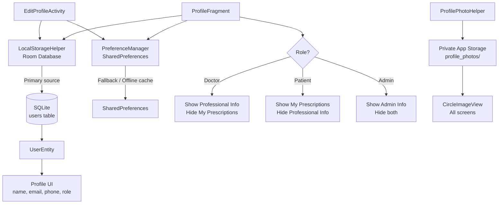
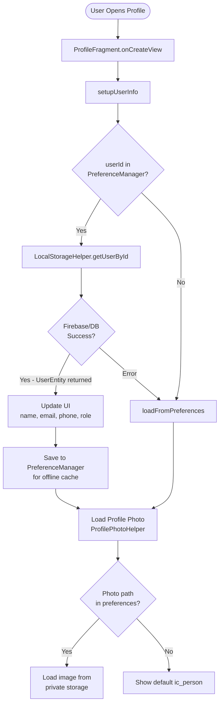
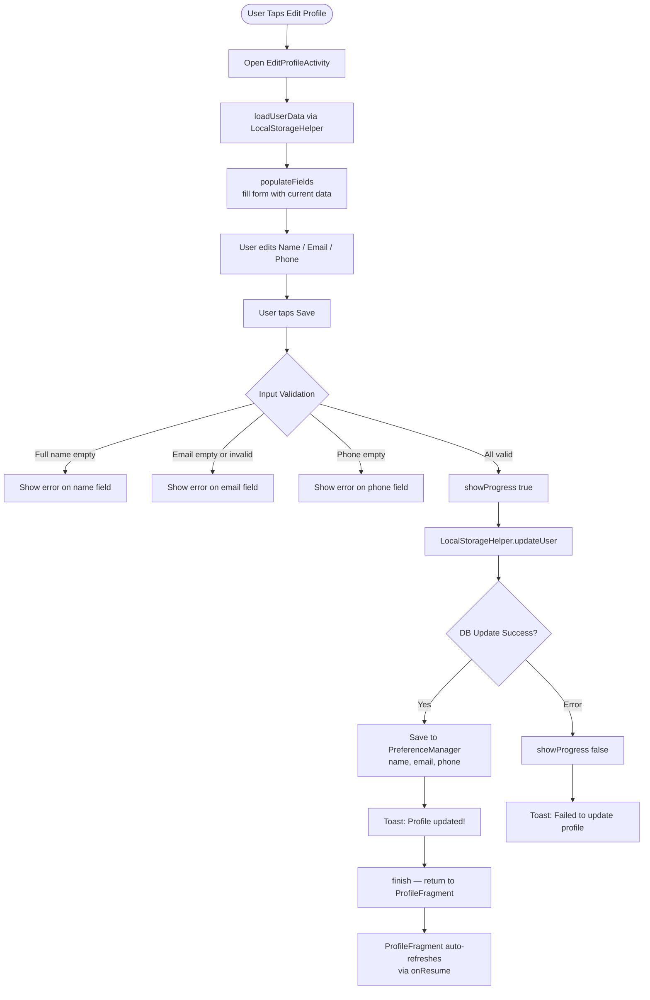
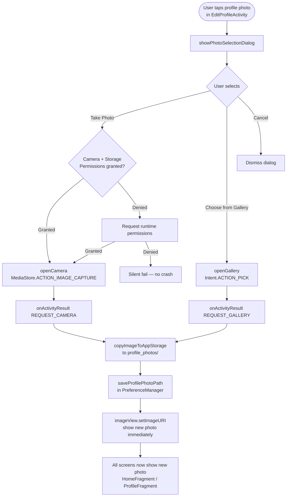
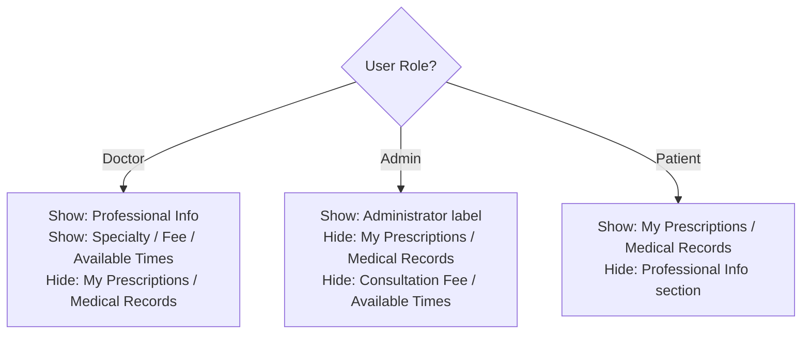
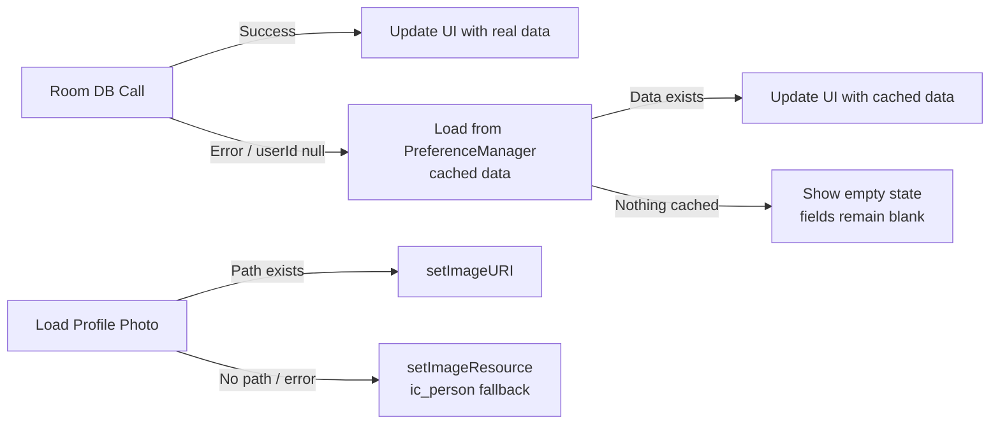

# 👤 HASET App — Profile System: Complete Guide
> *Combined from: PROFILE_DB_INTEGRATION_GUIDE.md · PROFILE_PHOTO_UPLOAD_GUIDE.md · EDIT_PROFILE_GUIDE.md*

---

## 📑 Table of Contents
1. [System Overview](#1-system-overview)
2. [Data Architecture](#2-data-architecture)
3. [Profile Display Flow](#3-profile-display-flow)
4. [Edit Profile Flow](#4-edit-profile-flow)
5. [Profile Photo System](#5-profile-photo-system)
6. [Role-Based Visibility](#6-role-based-visibility)
7. [UI Components](#7-ui-components)
8. [PreferenceManager Reference](#8-preferencemanager-reference)
9. [Error Handling & Fallbacks](#9-error-handling--fallbacks)
10. [Files Reference](#10-files-reference)

---

## 1. System Overview

The profile system combines **three layers** of functionality: real-time database reading, SharedPreferences caching (for offline access), and role-based UI visibility.



---

## 2. Data Architecture

### UserEntity (Room Database)
```java
@Entity(tableName = "users")
public class UserEntity {
    @PrimaryKey
    private String userId;
    private String email;
    private String password;   // SHA-256 hashed
    private String fullName;
    private String phone;
    private String role;       // "patient" | "doctor" | "admin"
    private String profileImage;
    private long createdAt;
}
```

### SharedPreferences Keys (PreferenceManager)

| Key | Purpose |
|-----|---------|
| `userId` | Logged-in user ID |
| `userRole` | Role for UI routing |
| `userName` | Cached full name |
| `userEmail` | Cached email address |
| `userPhone` | Cached phone number |
| `profilePhotoPath` | Local path to profile photo |
| `isLoggedIn` | Session status |

---

## 3. Profile Display Flow



---

## 4. Edit Profile Flow



### Input Validation Rules

| Field | Rule |
|-------|------|
| Full Name | Required, not empty |
| Email | Required, must match `EMAIL_ADDRESS` pattern |
| Phone | Required, not empty |
| Role | Read-only (system assigned, not editable) |

---

## 5. Profile Photo System

### Photo Upload Flow



### Storage Details

```
Private App Storage
└── profile_photos/
    └── profile_{timestamp}.jpg   ← each upload creates a new file
```

```java
// Static load utility (used everywhere)
public static void loadProfilePhoto(Context context, ImageView imageView) {
    String photoPath = preferenceManager.getProfilePhotoPath();
    if (photoPath != null && !photoPath.isEmpty()) {
        imageView.setImageURI(Uri.parse(photoPath));
    } else {
        imageView.setImageResource(R.drawable.ic_person);  // fallback
    }
}
```

### FileProvider Configuration (`file_paths.xml`)
```xml
<paths>
    <external-files-path name="images" path="Pictures/" />
    <files-path name="profile_photos" path="profile_photos/" />
    <cache-path name="cache" path="." />
</paths>
```

### Integration Points

| Screen | Component | Method |
|--------|-----------|--------|
| EditProfileActivity | CircleImageView (100dp) | `profilePhotoHelper.showPhotoSelectionDialog()` |
| ProfileFragment | ImageView (80dp) | `ProfilePhotoHelper.loadProfilePhoto()` |
| PatientHomeFragment | CircleImageView (52dp) | `ProfilePhotoHelper.loadProfilePhoto()` |

---

## 6. Role-Based Visibility



### Visibility Logic (from updateUserUI)

| View | Patient | Doctor | Admin |
|------|---------|--------|-------|
| `cardMedicalRecords` (My Prescriptions) | ✅ Visible | ❌ Gone | ❌ Gone |
| `tvMedicalRecordsTitle` | ✅ Visible | ❌ Gone | ❌ Gone |
| `cardMedicalInfo` (Professional Info) | ❌ Gone | ✅ Visible | ✅ Visible |
| `cardMedicalInfo2` | ❌ Gone | ✅ Visible | ✅ Visible |
| `tvProfessionalInfoTitle` | ❌ Gone | ✅ Visible | ✅ Visible |
| `layoutConsultationFee` | ❌ Gone | ✅ Visible | ❌ Gone |
| `layoutAvailableTimes` | ❌ Gone | ✅ Visible | ❌ Gone |

---

## 7. UI Components

### EditProfileActivity Layout Structure
```
ScrollView
└── LinearLayout
    ├── Header (Back button + "Edit Profile" title)
    ├── ProfileImageSection
    │   └── CircleImageView (100dp, clickable)
    ├── FormSection
    │   ├── TextInputEditText — Full Name
    │   ├── TextInputEditText — Email Address
    │   ├── TextInputEditText — Phone Number
    │   └── TextInputEditText — Role (read-only)
    ├── ActionButtons
    │   ├── MaterialButton — Save
    │   └── MaterialButton — Cancel
    └── ProgressOverlay (shown during save)
```

### Profile Photo XML (CircleImageView)
```xml
<!-- EditProfileActivity -->
<de.hdodenhof.circleimageview.CircleImageView
    android:id="@+id/ivProfileImage"
    android:layout_width="100dp"
    android:layout_height="100dp"
    android:src="@drawable/ic_person"
    android:clickable="true"
    app:civ_border_color="@color/white"
    app:civ_border_width="2dp" />

<!-- HomeFragment -->
<de.hdodenhof.circleimageview.CircleImageView
    android:id="@+id/ivProfile"
    android:layout_width="52dp"
    android:layout_height="52dp"
    app:civ_border_color="@color/white"
    app:civ_border_width="2.5dp" />
```

---

## 8. PreferenceManager Reference

### New Methods Added
```java
// Email
public void saveUserEmail(String email) { ... }
public String getUserEmail() { ... }

// Phone
public void saveUserPhone(String phone) { ... }
public String getUserPhone() { ... }

// Profile photo
public void saveProfilePhotoPath(String path) { ... }
public String getProfilePhotoPath() { ... }
```

---

## 9. Error Handling & Fallbacks



---

## 10. Files Reference

| File | Role |
|------|------|
| `ProfileFragment.java` | Main profile display, role-based visibility |
| `EditProfileActivity.java` | Profile editing, validation, save logic |
| `ProfilePhotoHelper.java` | Camera/gallery selection, storage, loading |
| `PreferenceManager.java` | Caching layer for offline profile access |
| `Constants.java` | All SharedPreferences key constants |
| `fragment_profile.xml` | Profile screen layout |
| `activity_edit_profile.xml` | Edit profile form layout |
| `fragment_patient_home.xml` | Home header with CircleImageView |
| `file_paths.xml` | FileProvider paths for camera/gallery |
| `circle_background_white.xml` | Oval background for profile photo |

---

*Last Updated: 2026-02-22 | HASET App — Profile Module*
